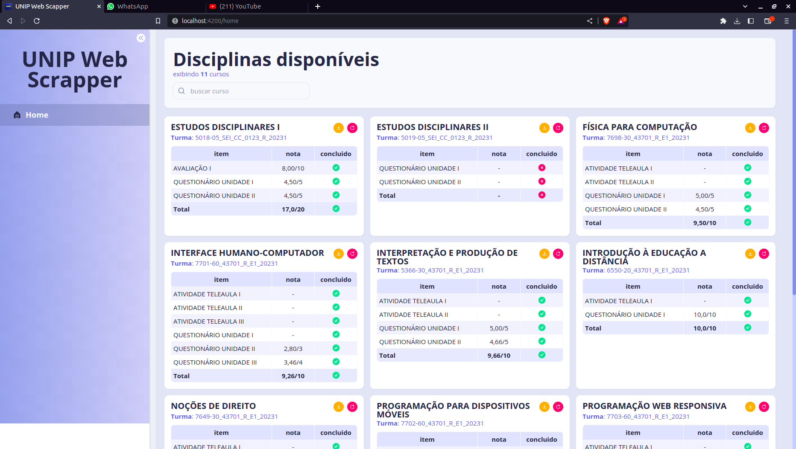
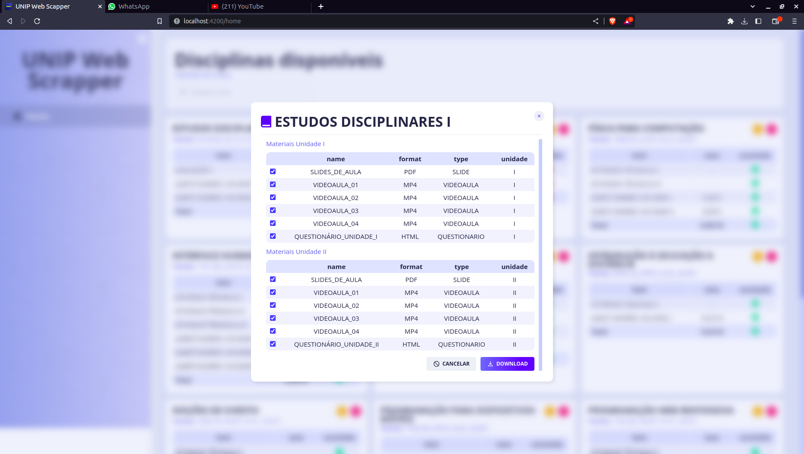
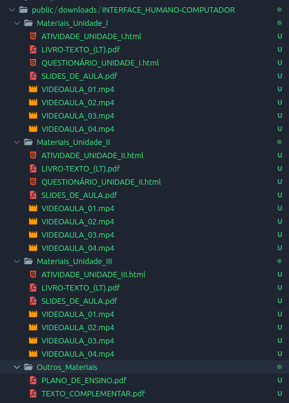
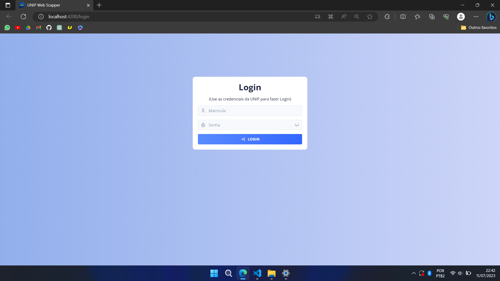

# UNIP Web Scraper


Programa para uso pessoal com finalidade de fazer o download automaticamente de todos os arquivos disponíveis na plataforma online da faculdade. Este código foi desenvolvido para facilitar o processo de obtenção de materiais de estudo, como slides, apostilas, exercícios, entre outros, disponibilizados pelos professores no sistema online da universidade.


## Funcionalidades
O UNIP Web Scraper possui as seguintes funcionalidades:
- Fazer login automaticamente na plataforma online da UNIP com credenciais fornecidas pelo usuário.
- Navegar pelas disciplinas e unidades curriculares do curso do usuário.
- Baixar automaticamente todos os arquivos disponíveis em cada disciplina/unidade curricular.
- Organizar os arquivos baixados em pastas de acordo com a estrutura da plataforma UNIP.


## Navegando pelo sistema

### Tela principal
São exibidos todos os cursos que o usuário possui juntamente com suas respectivas notas em questionários, atividades e avaliações.


### Modal de Download
Permite ver todos os materias diponíveis na plataforma, incluindo vídeos, PDFs e páginas de questionários e atividades.


Ao fazer download, os arquivos serão encontrados em `C:/UNIP-Web-Scrapper` na seguinte estrutura


### Tela de login
São apresentados os campos de matricula e senha para fazer login no sistema.
OBS: as credenciais usadas para fazer login no sistema são as mesmas cadastradas no sistema da universidade


## Instruções para execução do projeto

1. Inicialize os containers
```bash
docker-compose up
```

2. acesse a URL no navegador
```
localhost:4200
````